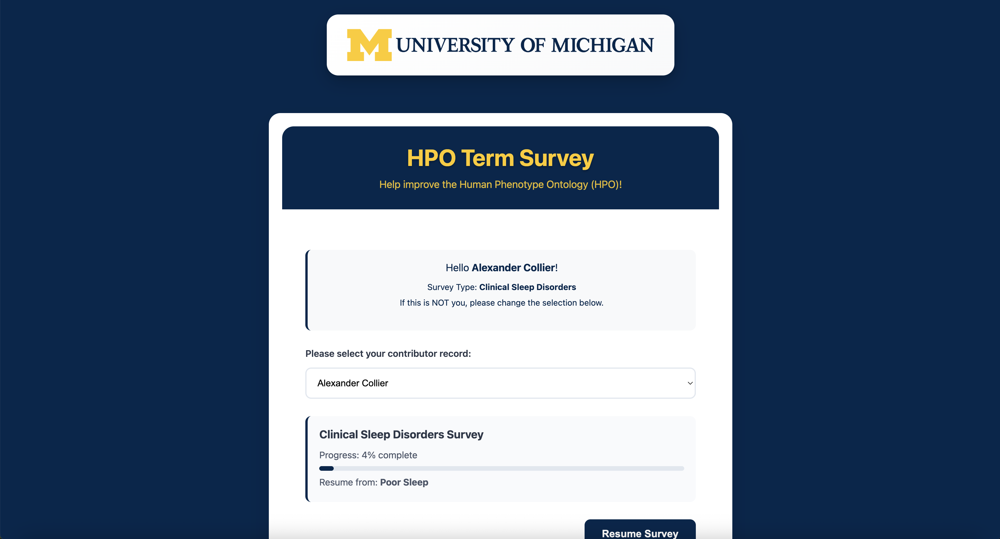

# Welcome.vue

A Vue.js component for collecting detailed feedback on medical/clinical terminology, including term names, definitions, hierarchical relationships, and synonyms. Built for the University of Michigan's HPO survey.

## Overview

This portal provides access to the **HPO Term Survey**, designed to help improve the **Human Phenotype Ontology (HPO)**.  

When a user visits the survey link, the system automatically loads their contributor record and displays the following information:  
- **Contributor name** (auto-filled based on the unique survey link).  
- **Survey type** (e.g., *Clinical Sleep Disorders*).  
- **Progress tracking**, showing both the percentage complete and a progress bar.  
- **Resume point**, indicating exactly where the user last left off (e.g., "Resume from: Poor Sleep").  

Participants may take multiple surveys, and the system ensures that each contributor can continue seamlessly from their last saved point.  

Below is an example screenshot of the survey interface:

---

## How It Works

1. **Unique Survey Link**  
   Each contributor receives a personalized link. When opened, the system automatically identifies the participant and loads their contributor record.

2. **Survey Type Loaded**  
   The system displays the specific survey the participant is working on (e.g., *Clinical Sleep Disorders*). Contributors may be invited to multiple surveys over time.

3. **Progress Tracking**  
   A progress bar and percentage complete are shown so participants know how far along they are in the survey.

4. **Resume Where You Left Off**  
   If the participant previously exited the survey, the system highlights the exact question or section where they stopped (e.g., *Resume from: Poor Sleep*).

5. **Continue or Switch Surveys**  
   Participants can pick up where they left off or navigate to other available surveys assigned to them.